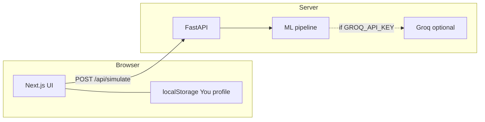

# MediTwin — Pharma Simulation & Patient Exposure Model

<div align="center">

**Educational / investigational tooling — not medical advice or a diagnostic device.**

[](https://nextjs.org/)
[](https://fastapi.tiangolo.com/)
[](https://www.python.org/)
[](https://www.typescriptlang.org/)

</div>

---

## Problem Statement

People often struggle to **reason about how a medication might interact with their own context**—age, labs, co‑medications, and conditions—using only static leaflets or generic search results. Clinicians and researchers similarly need **transparent, reproducible ways to explore “what‑if” exposure scenarios** without replacing professional judgment.

**MediTwin** addresses the gap between **raw pharmacology data** and **interpretable, personalized (simulated) narratives**: a structured pipeline turns patient + drug inputs into risk signals, organ‑level stress over time, side‑effect likelihoods, and optional natural‑language enrichment—while staying clearly labeled as **educational simulation**, not a clinical decision system.

---

## Solution Overview

MediTwin is a **full‑stack application**:

1. **Backend (FastAPI)** — Accepts a patient profile and one or more drugs, runs a **deterministic ML-style pipeline** (risk scoring, organ effects, interactions, contraindications, side effects), caches results, and optionally calls **Groq (LLaMA-class)** to enrich explanations **only when an API key is supplied via environment variable** (never hardcoded).
2. **Frontend (Next.js)** — Patient flow: pick a subject (presets or a **“You”** profile stored in **browser `localStorage`**), choose a compound and dose window, run the simulation, scrub a **timeline**, inspect a **3D body map**, and **export a PDF** summary.

This repository is a **complete source snapshot** with **`frontend/`** and **`backend/`** trees, real implementation files (not placeholders), and **no committed secrets** (use `.env.example` files locally).

---

## Key Features

| Feature | Description |
|--------|-------------|
| **Hybrid pipeline** | Rule + model-style stages compose risk, organs, interactions, and dose guidance. |
| **Timeline simulation** | Multi-step exposure over 24–72h with scrubbable steps. |
| **3D body map** | Three.js / React Three Fiber visualization with organ hotspots driven by pipeline output. |
| **Patient presets + “You”** | Built-in personas plus optional local questionnaire → stored only in the browser. |
| **Population / pharma routes** | Additional API surface for cohort-style exploration (see `backend/api/`). |
| **PDF export** | Client-side report generation for demo and review. |
| **Optional LLM layer** | Groq-backed enrichment when `GROQ_API_KEY` is set; pipeline runs without it. |

---

## Tech Stack Used

| Layer | Technologies |
|--------|----------------|
| **Frontend** | Next.js 16 (App Router), React 19, TypeScript, Tailwind CSS v4, Framer Motion, Zustand, React Three Fiber, Drei, Three.js, Recharts, `@react-pdf/renderer` |
| **Backend** | Python 3.11, FastAPI, Uvicorn, Pydantic v2, Groq SDK (optional), python-dotenv |
| **Data** | JSON drug / class catalogs, optional CSV evidence index (see `backend/data/`) |
| **DevOps** | Dockerfiles for `frontend` (Next standalone) and `backend`; env-based configuration |

---

## Repository Structure

```
meditwin_notinterested/
├── README.md                 ← This file (required for submission)
├── ENVIRONMENT.example       ← Variable checklist (no secrets)
├── .gitignore
├── backend/
│   ├── main.py               # FastAPI app, CORS, routers, lifespan
│   ├── requirements.txt
│   ├── Dockerfile
│   ├── data_loader.py
│   ├── groq_enricher.py      # Optional LLM (env key only)
│   ├── api/                  # simulate, population routes
│   ├── ml_pipeline/          # risk, organs, side effects, etc.
│   ├── data/                 # drugs.json, drug_classes.json, evidence/
│   └── tests/
└── frontend/
    ├── package.json
    ├── next.config.ts
    ├── app/                  # App Router pages (patient, pharma)
    ├── components/           # BodyMap3D, timeline, PDF, etc.
    ├── lib/                  # API client, drug pool, profile storage
    ├── store/
    └── types/
```

---

## How to Run the Project

### Prerequisites

- **Node.js 20+** and **npm**
- **Python 3.11+**
- (Optional) **Groq API key** for LLM-enriched text — not required for core simulation

### 1. Backend

```bash
cd backend
python -m venv .venv

# Windows
.venv\Scripts\activate
# macOS / Linux
# source .venv/bin/activate

pip install -r requirements.txt
cp .env.example .env
# Edit .env: set GROQ_API_KEY only if you want enrichment; otherwise leave placeholder.

uvicorn main:app --reload --host 0.0.0.0 --port 8000
```

Health check: open `http://127.0.0.1:8000/health` — expect JSON with `status: ok`.

### 2. Frontend

```bash
cd frontend
npm install
cp .env.example .env.local
# Ensure: NEXT_PUBLIC_API_URL=http://127.0.0.1:8000

npm run dev
```

Open **http://localhost:3000** (default). The app redirects to the patient simulation flow.

### 3. Docker (optional)

Build args and ports are documented in each `Dockerfile`. Set `NEXT_PUBLIC_API_URL` at **build time** for the frontend image so the browser calls the correct API URL.

---

## Architecture (high level)



---

## Security & privacy notes

- **No API keys or production URLs are committed.** Use `ENVIRONMENT.example`, `backend/.env.example`, and `frontend/.env.example`.
- **“You” profile data** never leaves the browser unless the user exports a report themselves.
- Outputs are **simulated**; always show the in-app disclaimer for hackathon and public demos.

---

## Disclaimer

MediTwin is intended for **education, research demos, and hackathon evaluation** only. It does **not** provide medical advice, diagnosis, or treatment recommendations. Do not use for clinical decisions.

---

<div align="center">

**MediTwin** · *Simulated exposure modeling for learning and prototyping*

</div>
