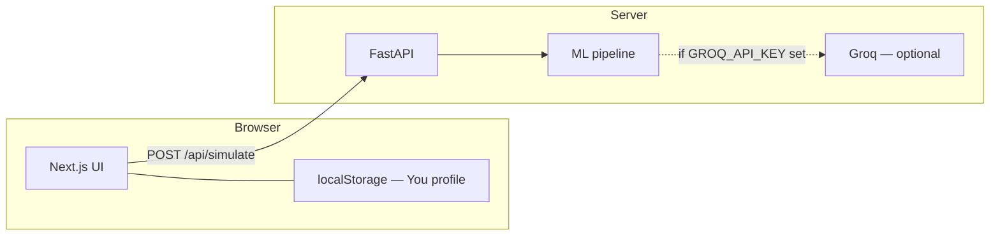

# MediTwin — Pharma Simulation & Patient Exposure Model

<div align="center">

**Educational / investigational tooling — not medical advice or a diagnostic device.**

[](https://nextjs.org/)
[](https://fastapi.tiangolo.com/)
[](https://www.python.org/)
[](https://www.typescriptlang.org/)

</div>

## Problem Statement

People often struggle to reason about how a medication might interact with their own context — age, labs, co-medications, and conditions — using only static leaflets or generic search results. Clinicians and researchers similarly need transparent, reproducible ways to explore "what-if" exposure scenarios without replacing professional judgment.

**MediTwin** addresses the gap between raw pharmacology data and interpretable, personalized (simulated) narratives: a structured pipeline turns patient + drug inputs into risk signals, organ-level stress over time, side-effect likelihoods, and optional natural-language enrichment — while staying clearly labeled as **educational simulation**, not a clinical decision system.

## Solution Overview

MediTwin is a full-stack application:

1. **Backend (FastAPI)** — Accepts a patient profile and one or more drugs, runs a deterministic ML-style pipeline (risk scoring, organ effects, interactions, contraindications, side effects), caches results, and optionally calls **Groq (LLaMA-class)** to enrich explanations only when an API key is supplied via environment variable (never hardcoded).
2. **Frontend (Next.js)** — Patient flow: pick a subject (presets or a "You" profile stored in browser `localStorage`), choose a compound and dose window, run the simulation, scrub a timeline, inspect a 3D body map, and export a PDF summary.

## Key Features

| Feature | Description |
|---------|-------------|
| Hybrid pipeline | Rule + model-style stages compose risk, organs, interactions, and dose guidance. |
| Timeline simulation | Multi-step exposure over 24–72h with scrubbable steps. |
| 3D body map | Three.js / React Three Fiber visualization with organ hotspots driven by pipeline output. |
| Patient presets + "You" | Built-in personas plus optional local questionnaire stored only in the browser. |
| Population / pharma routes | Additional API surface for cohort-style exploration (see `backend/api/`). |
| PDF export | Client-side report generation for demo and review. |
| Optional LLM layer | Groq-backed enrichment when `GROQ_API_KEY` is set; pipeline runs fine without it. |

## Tech Stack

| Layer | Technologies |
|-------|-------------|
| Frontend | Next.js 16 (App Router), React 19, TypeScript, Tailwind CSS v4, Framer Motion, Zustand, React Three Fiber, Drei, Three.js, Recharts, `@react-pdf/renderer` |
| Backend | Python 3.11, FastAPI 0.111, Uvicorn, Pydantic v2, Groq SDK 0.9, python-dotenv, httpx |
| Data | JSON drug / class catalogs, optional CSV evidence index (see `backend/data/`) |
| DevOps | Dockerfiles for `frontend` (Next standalone) and `backend`; env-based configuration |

## Repository Structure

```
meditwin_notinterested/
├── README.md                 ← This file
├── ENVIRONMENT.example       ← Variable checklist (no secrets)
├── .gitignore
├── backend/
│   ├── main.py               # FastAPI app, CORS, routers, lifespan
│   ├── requirements.txt
│   ├── Dockerfile
│   ├── data_loader.py
│   ├── groq_enricher.py      # Optional LLM (env key only)
│   ├── api/                  # simulate, population routes
│   ├── ml_pipeline/          # risk, organs, side effects, etc.
│   ├── data/                 # drugs.json, drug_classes.json, evidence/
│   └── tests/
└── frontend/
    ├── package.json
    ├── next.config.ts
    ├── app/                  # App Router pages (patient, pharma)
    ├── components/           # BodyMap3D, timeline, PDF, etc.
    ├── lib/                  # API client, drug pool, profile storage
    ├── store/
    └── types/
```

## API Keys Setup

Before running the project, you need to configure environment variables. No keys are committed to this repository — you must supply your own.

### Required

**None.** The core simulation pipeline is fully deterministic and runs without any external API keys.

### Optional: Groq (LLM Enrichment)

The backend optionally calls Groq's LLaMA-class models to generate natural-language clinical summaries, doctor notes, and enriched explanations. Without this key the pipeline still works — you just get shorter, template-based text instead of AI-generated paragraphs.

1. Sign up at [console.groq.com](https://console.groq.com)
2. Go to **API Keys** and create a new key
3. Copy the key and add it to `backend/.env` (see setup below)

```
GROQ_API_KEY=gsk_xxxxxxxxxxxxxxxxxxxxxxxxxxxxxxxxxxxxxxxxxxxxxxxxxxxx
```

The model used is `llama-3.3-70b-versatile` (configurable via code in `groq_enricher.py`). Groq's free tier is sufficient for demo usage.

### Environment Variable Reference

| Variable | File | Required | Default | Description |
|----------|------|----------|---------|-------------|
| `GROQ_API_KEY` | `backend/.env` | No | _(empty)_ | Groq API key for LLM-enriched text generation |
| `CORS_ORIGINS` | `backend/.env` | No | `http://localhost:3000` | Comma-separated list of allowed frontend origins |
| `ALLOWED_HOSTS` | `backend/.env` | No | `localhost,127.0.0.1,*` | Trusted hosts for the backend |
| `PORT` | `backend/.env` | No | `8000` | Port the backend listens on |
| `UVICORN_WORKERS` | `backend/.env` | No | `1` | Number of Uvicorn worker processes |
| `LOG_LEVEL` | `backend/.env` | No | `INFO` | Logging verbosity (`DEBUG`, `INFO`, `WARNING`, `ERROR`) |
| `NEXT_PUBLIC_API_URL` | `frontend/.env.local` | **Yes** | — | Full URL of the backend API (e.g. `http://127.0.0.1:8000`). Must be set before `npm run dev`. |

## How to Run

### Prerequisites

- Node.js 20+ and npm
- Python 3.11+
- (Optional) A Groq API key if you want AI-enriched simulation text

### 1. Backend

```bash
cd backend

# Create and activate a virtual environment
python -m venv .venv

# Windows
.venv\Scripts\activate
# macOS / Linux
source .venv/bin/activate

# Install dependencies
pip install -r requirements.txt

# Set up environment variables
cp .env.example .env
# Open .env and paste your GROQ_API_KEY if you have one.
# Leave it blank or omit it entirely to run without LLM enrichment.

# Start the server
uvicorn main:app --reload --host 0.0.0.0 --port 8000
```

Health check: open `http://127.0.0.1:8000/health` — expect a JSON response like:

```json
{ "status": "ok", "drugs_loaded": 120, "classes_loaded": 18, "evidence_drugs_loaded": 45 }
```

### 2. Frontend

```bash
cd frontend
npm install

# Set up environment variables
cp .env.example .env.local
# Open .env.local and confirm:
# NEXT_PUBLIC_API_URL=http://127.0.0.1:8000

npm run dev
```

Open **http://localhost:3000**. The app will redirect into the patient simulation flow.

### 3. Docker (optional)

Each service has its own `Dockerfile`. Build and run them independently or with Docker Compose. The key thing to note: `NEXT_PUBLIC_API_URL` must be passed as a **build argument** for the frontend image because Next.js bakes public env vars at build time.

```bash
# Backend
docker build -t meditwin-backend ./backend
docker run -p 8000:8000 -e GROQ_API_KEY=your_key meditwin-backend

# Frontend (replace API URL with your backend's public address)
docker build --build-arg NEXT_PUBLIC_API_URL=http://your-backend:8000 -t meditwin-frontend ./frontend
docker run -p 3000:3000 meditwin-frontend
```

## Architecture



## Security & Privacy Notes

- No API keys or production URLs are committed. Use the `.env.example` files as templates and fill them in locally only.
- The "You" profile data never leaves the browser unless the user exports a report themselves.
- Outputs are simulated. Always display the in-app disclaimer for hackathon and public demos.

## Disclaimer

MediTwin is intended for education, research demos, and hackathon evaluation only. It does **not** provide medical advice, diagnosis, or treatment recommendations. Do not use it for clinical decisions.

<div align="center">

**MediTwin** · *Simulated exposure modeling for learning and prototyping*

</div>
